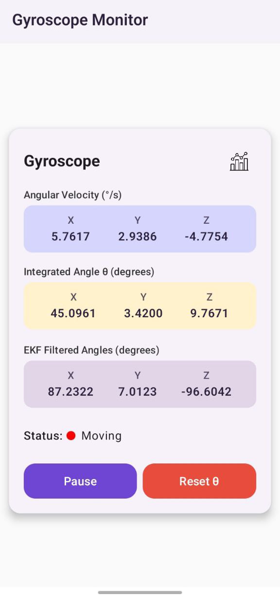
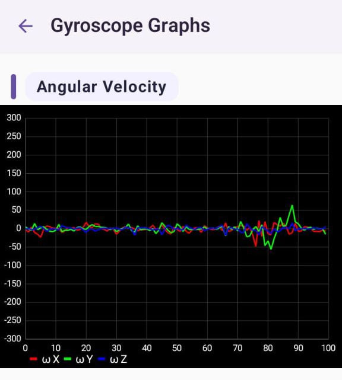
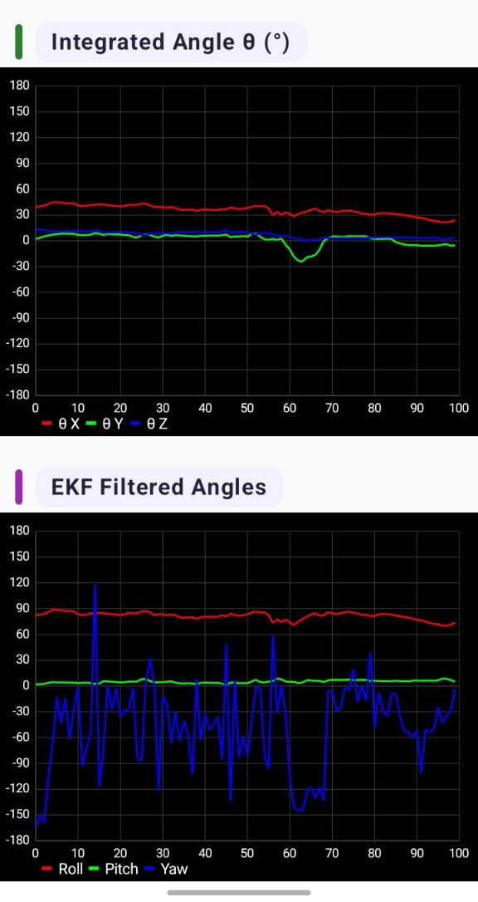

# Drift-Free Gyroscope

An Android application implementing Extended Kalman Filter (EKF) for accurate gyroscope-based orientation tracking with Zero Velocity Update (ZUPT) drift correction.


## Features

- **Extended Kalman Filter**: Advanced sensor fusion for accurate orientation estimation
- **ZUPT Integration**: Zero velocity updates to minimize drift during stationary periods  
- **Multi-Sensor Fusion**: Combines gyroscope, accelerometer, and magnetometer data
- **Real-time Visualization**: Live graphs showing raw sensor data vs filtered results
- **Bias Estimation**: Automatic gyroscope bias correction and calibration

## Technical Implementation

### Core Technologies
- **Language**: Kotlin
- **UI Framework**: Jetpack Compose  
- **Architecture**: Clean separation of concerns with modular components
- **Sensor Processing**: Real-time sensor fusion with mathematical filtering

### Mathematical Foundation
- **Extended Kalman Filter**: 6-state implementation (roll, pitch, yaw + gyro biases)
- **Dynamic Noise Adjustment**: Adapts filter parameters based on motion intensity
- **Sensor Fusion Algorithm**: Combines multiple IMU sensors for robust orientation tracking
- **ZUPT Algorithm**: Detects stationary periods to correct accumulated drift

## Project Structure

```
src/main/java/com/example/kalmanfilter/
├── Constants.kt # Configuration constants
├── ExtendedKalmanFilter.kt # EKF mathematical implementation
├── SensorReading.kt # Data structures
├── SensorScreens.kt # Main UI components
├── GraphScreens.kt # Visualization components
└── MainActivity.kt # Sensor management & app lifecycle
```

## Getting Started

### Prerequisites
- Android Studio Arctic Fox or newer
- Android device with API level 23+
- Device sensors: Gyroscope, Accelerometer, Magnetometer

### Installation
1. Clone the repository:
   ```bash
   git clone https://github.com/YehiaAlii/drift-free-gyroscope.git
   ```
2. Open in Android Studio
3. Build and run on your Android device
4. Grant sensor permissions when prompted

## Usage

1. **Launch the app** on your Android device
2. **Grant permissions** for sensor access
3. **Observe real-time data**:
   - Raw gyroscope readings
   - Integrated angles (with drift)
   - EKF filtered angles (drift-corrected)
4. **View graphs** by tapping the chart icon
5. **Reset orientation** using the Reset θ button

## Details

### Extended Kalman Filter Implementation
- **State Vector**: `[roll, pitch, yaw, bias_gyro_x, bias_gyro_y, bias_gyro_z]`
- **Prediction Step**: Uses gyroscope data with bias correction
- **Update Step**: Incorporates accelerometer and magnetometer measurements
- **Dynamic Tuning**: Adapts noise parameters based on motion characteristics

### ZUPT (Zero Velocity Update)
- **Motion Detection**: Analyzes gyroscope magnitude to detect stationary periods
- **Bias Estimation**: Updates gyroscope bias during stationary phases
- **Drift Correction**: Prevents long-term orientation drift

## Screenshots

<table>
  <tr>
    <td align="center">
      
    </td>
    <td align="center">
      
      <br><br>
      
    </td>
  </tr>
</table>

*Real-time sensor data, angular velocity tracking, and EKF-filtered orientation with drift correction*
